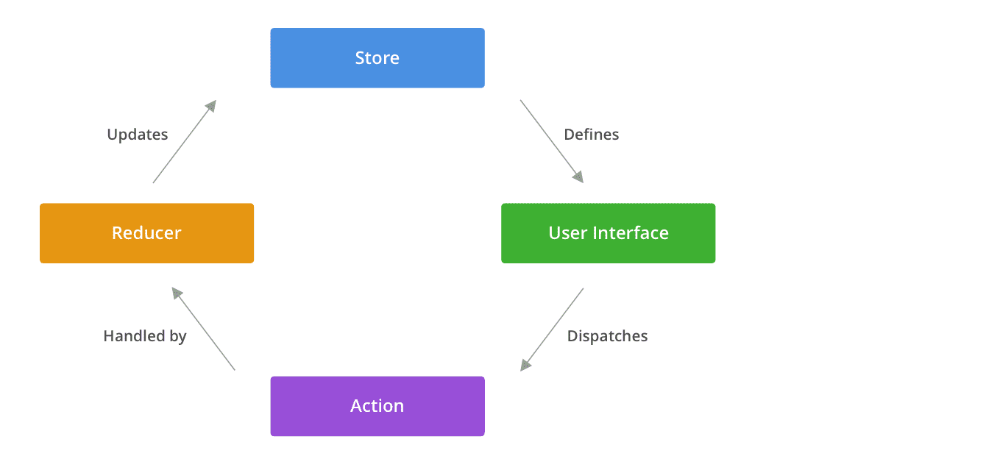

# LAB - Class 37

## Project: storefront

### Author: Anolla Haddad

### Links and Resources

- [submission PR](https://github.com/401-advanced-javascript-Anolla/storefront/pull/2)
- [ci/cd](https://github.com/401-advanced-javascript-Anolla/storefront/pull/1#partial-pull-merging) (GitHub Actions)
<!-- - [back-end server url](http://xyz.com) (when applicable) -->
<!-- - [front-end application](http://xyz.com) (when applicable)  -->

<!-- ### Setup

#### `.env` requirements (where applicable)

i.e.

- `PORT` - Port Number
- `MONGODB_URI` - URL to the running mongo instance/db -->

#### How to initialize/run the application

- `npm start`

<!-- #### How to use your library (where applicable)

#### Tests

- How do you run tests?
- Any tests of note?
- Describe any tests that you did not complete, skipped, etc -->

#### UML

